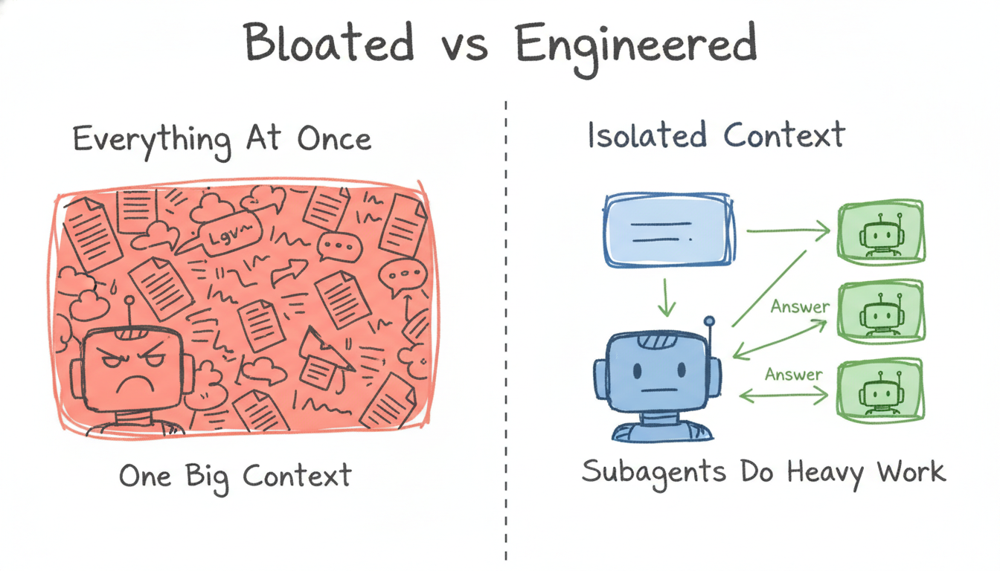

# Context Engineering Starter Kit

If your AI assistant feels like it got dumber, it probably didn't. Your **context** did.

This kit turns context discipline from advice into tooling: it **measures** what your setup silently costs, **watches** your live usage, **guards** the door against the reads that cause rot, **diagnoses** a session that's gone foggy, and **isolates** heavy work so the rot never happens. Works with Claude Code out of the box; the ideas transfer to any assistant that reads a `CLAUDE.md`.

No magic, no dependencies — plain Node scripts and skills you can read in five minutes.

---

## Why your AI "feels worse"

Four things cause it, and only one of them is the model's fault:

1. **Context rot.** The longer a conversation runs, the worse the model recalls what happened early on. Attention weights recent tokens; the stuff from 30 messages ago quietly drops out. This is the big one, and it's the one you can fix.
2. **Product-layer changes.** Defaults, caching, verbosity caps in the *app* shift over time. These get patched. Not your problem to manage.
3. **Infrastructure.** Mixed hardware and quantization across a provider's fleet can cause intermittent quality dips. Documented, real, out of your hands.
4. **You.** You got used to how good it is, your prompts got lazier, and your tasks got harder. Honest, but true.

You can't fix 2, 3, or 4. You can fix 1 completely. That's what this kit is for.

> Sources worth reading: Anthropic's [postmortem of three recent issues](https://www.anthropic.com/engineering/a-postmortem-of-three-recent-issues) and [Effective context engineering for AI agents](https://www.anthropic.com/engineering/effective-context-engineering-for-ai-agents).

---

## The one idea

**The context window is working memory, not a hard drive.** It's a whiteboard, not a filing cabinet. Everything the model can "see" right now — your files, the conversation, tool outputs, instructions — competes for the same finite space. Fill it with noise and the signal gets buried.



---

## The system — five jobs, five tools

| Job | Tool | What it does |
|---|---|---|
| **Measure** | `tools/context-audit.js` | Scans your project and reports the **session tax** — what loads into context on *every single message*: `CLAUDE.md`, everything it `@`-imports, every rule file, every skill's frontmatter. Grades it A–F and tells you exactly what to trim. Most people have never seen this number. |
| **Watch** | `statusline/context-statusline.js` | A live context meter in your status bar: `CTX 82k/200k 41% [####------] FRESH`. You see rot coming instead of noticing it twenty sloppy messages later. |
| **Guard** | `hooks/large-read-guard.js` | A PreToolUse hook that physically stops oversized files from being read into your main context — and tells the model the right move instead (slice it, grep it, or send a subagent). Rot prevention, enforced in code. |
| **Diagnose** | `skills/context-check` | `/context-check` combines the audit's hard numbers with a judgment read of the live session: what's clogging the window, how bad the rot risk is, and the one move to make (compact / fresh / subagent). |
| **Isolate** | `skills/research` | `/research` dispatches a subagent to do heavy reading in its own disposable context and report back **only the answer**. The 40 files never touch your session. |

They reinforce each other: the **statusline** warns you, **context-check** tells you what to do, the **guard** stops the mistake at the door, and **research** is the escape hatch all three of them point to. The **audit** makes sure you start every session as cheap as possible.

Also in the kit:

| File | What it does |
|---|---|
| `CLAUDE.md` | An annotated, context-lean memory template. Copy it, fill it in, delete the notes. |
| `CONTEXT-HYGIENE.md` | The decision rules: when to compact, when to start fresh, when to dispatch a subagent. |
| `templates/memory-template.md` | A single-fact memory file format for persistent, low-cost recall across sessions. |
| `hooks/settings-snippet.json` | Copy-paste config that registers the hook and the statusline. |

---

## Install

Core install — two copies, done:

```bash
git clone https://github.com/faiqbasharatai-del/context-engineering-starter-kit.git
cd your-project
cp ../context-engineering-starter-kit/CLAUDE.md ./CLAUDE.md   # then fill it in
cp -r ../context-engineering-starter-kit/skills ./.claude/skills
```

Power-ups (recommended — this is where the kit stops being advice and starts being enforcement):

```bash
cp -r ../context-engineering-starter-kit/tools      ./.claude/tools
cp -r ../context-engineering-starter-kit/hooks      ./.claude/hooks
cp -r ../context-engineering-starter-kit/statusline ./.claude/statusline
```

Then merge `hooks/settings-snippet.json` into your project's `.claude/settings.json` and restart Claude Code. That registers the read-guard and the statusline.

Try it immediately:

```bash
node .claude/tools/context-audit.js        # what does every session cost you?
```

…and run `/context-check` inside Claude Code whenever a session starts feeling foggy.

Tuning: the read-guard's threshold defaults to 100 KB (~25k tokens). Set `CONTEXT_GUARD_KB` to change it.

---

## Honesty notes

- Token counts in the audit and the fallback statusline path are **estimates** (chars ÷ 4). For exact live numbers, run `/context` inside Claude Code — the statusline uses the real figures when your version provides them.
- `/context-check`'s session half is the model reasoning about its own window — a judgment layer on top of the numbers, not a profiler. That's by design: the numbers say how full, the judgment says what to do.

---

## License

MIT. Use it, fork it, ship it.
